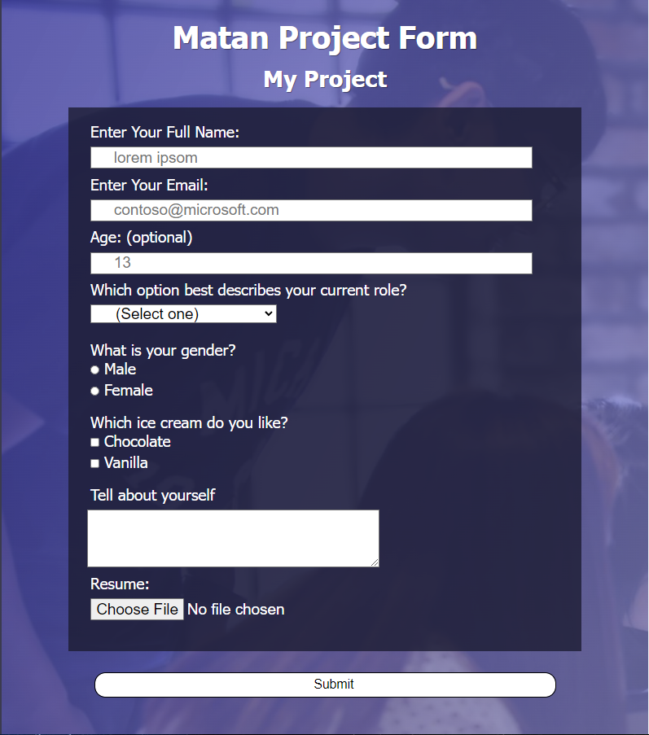

# First Project - Build A Survey Form Project

<h1>About the project</h1>
This is my first steps in learning full stack development at FreeCodeCamp Academy. 
I learned alot about HTML and CSS, the use if div, sections, fieldsets and textarea. Also, I learned alot about input element and how it's affect the page.
Text type, file type, radio and checkbox types, submit types etc..
I learned about the importance of ID, Value and Name inside the input or any element for order, style on CSS and sending data to the "Action" on the Form Element (or any other element).
I learned how to adjust the website for mobiles or tablets with meta, and how to change the website charset using meta (viewport, width=device-width, initial scale=1.0).
I learned about CSS and how to manipulate elements with properties, how to use colors (RGB, RGBA, HSL, HSLA, HEX colors #, Web Colors "white") and opacity (and alpha), how to exclude elements from being picked on the CSS attribute selector
