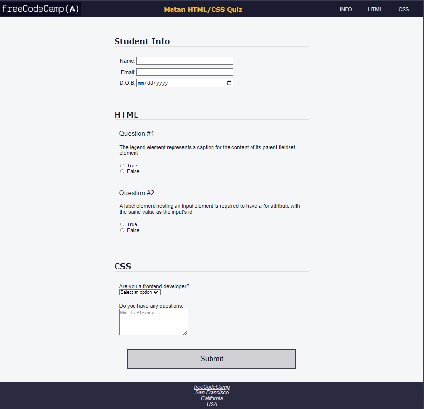

# Learn Accessibility by Building a Quiz

<h1>Class Notes</h1>
•	In form there’s 2 methods I should know about: POST and GET
 
•	Every element can have an accessibility to make things easier to disabled people. The role and the aria-labelledby. The role will be the What the element is about and the aria-labelledby will be the reference to the Element id.
aria-labelledby=”123”
<h1 id=”123”>123</h1> 
 
•	Label for will indicate what label is for what input.
<label for=”INPUT_ID”>
<input id=”INPUT_ID”>
   
•	Every input should have id, type, value, name
   
•	Pseudo property :before will add content before. For example. If I have p element that represent a question number, instead of writing Question #1, #2 and so on, I will create a property for p:before { content: “Question #” } and will only number the Questions accordingly.
   
•	To remove underline of a text I will use Text-decoration: none;
   
•	Using hover – element:hover
   
•	Changing the cursor with cursor: value
   
•	Accesskey attribute is using a shortcut (keyboard key) to focus on a element. (not best-practice, but sometimes necessarily) 
