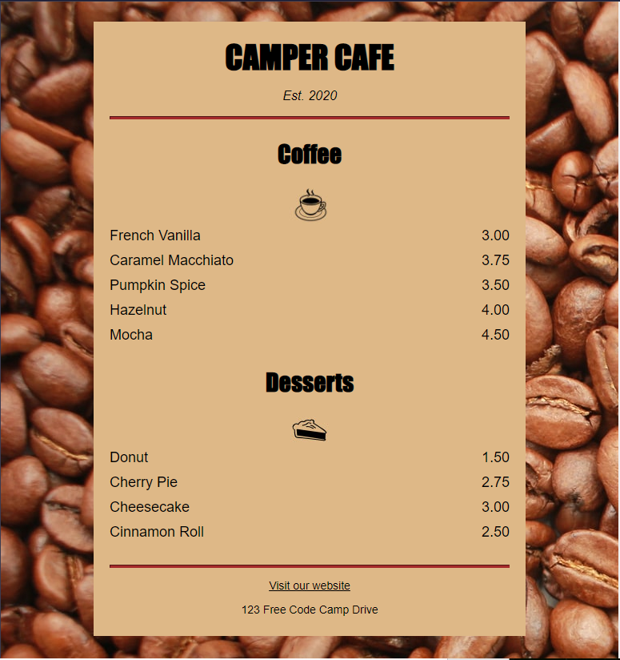

# Learn Basic CSS by Building Cafe Menu

 
 
<h1> Class Notes </h1>
1.	In the “Head” we can add an “Style” Element and store within our CSS.
 
2.	In the style element we should call the element, open a brackets and declare the property and value.
For example:
h1 
{
    text-align: center;  notice the “ ; “ needed to close the property and move on.
} 
 
3.	Single type selector helps us to combine in one place a different elements that have the same property. 
For example:
h1, h2, p 
{
    text-align: center; 
}
 
4.	When having a lot of css it is better to stores them in a different .css file and link to the file. In order to link to the file we will use the “link” element inside the head element.
The link element should have 3 values. Rel, type and href. 
the rel is used to declare this is a stylesheet,
the type is used to declare the type, which is “text/css” and the href link to the .css file.
“<link ref=”stylesheet” type=”text/css” href=”style.css”>
 
5.	In order that our website will be the same for mobile or tablets we need to include a meta element.
“<meta name=”viewport” content=”width=device-width, initial-sacle=1.0” />”
 
6.	Div elemnt is used to design layout. 
 
7.	Margin-left and margin-right set to auto will align the div within its parent element.
margin is to be consider as invisible spaces around the block / element.
 
8.	Width property is used in pixles or percent to determine the size of the block.
a 80% will be 80% of the parent element.
 
9.	Class selector in CSS is used with a dot (.) before the class declared. 
Example : .Class
Then, in the HTML we need to declare an element with the class.
For example : “
”
 
10.	Background image inside a CSS should be declared using a url(imagelocation)
   
11.	Article element is used to contain multiple elements that have a related information.
For example: Product and price.
“<article>

 product 

 price 

</article>”
 
12.	An element with a class which contains an element inside it can be styled also.
for example an “
” element inside a “<article class=”item”>” element  can be styled like this:
.item p {property: value;}
 
13.	A paragraph element is a block, so every call to the element represent a new line. If we want to arrange it, we should use the display: in-line; property: value.
this will make (using the nested class element above) the paragraphs unite and the same line.
 
14.	Padding (right and left) will give our block / element some space. 
it can also be used as “padding” only if our value within all 4 properties are the same.
 
15.	Max-width will help with wider screen so the block won’t grow too far.
 
16.	Font-family 
 
17.	Hr = divider between sections.
 
18.	Margin 
 
19.	To use CSS pseudo-selector, I should use element:act, Exmaple will be a:visited, element:hover..
