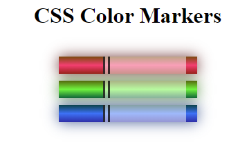

# Learn CSS Colors by Building a Set of Colored Markers

<h1>Class Notes:</h1>
1.	Margin uses the top, bottom, left and right. 
when set to auto, it will be centralized.
if you define 2 properties, the first will be top and bottom and then left and right.
as so, setting margin: 10px auto; will give 10px to bottom and top and auto property to left and right.
 
2.	Class can have more than two properties. Class=”property1 proprety2” 
then, in CSS we can set .property1 to its value and .property2 to its value.
 
3.	In CSS colors have 2 sets, RGB and non-RGB.
rgb will be set using rgb(0, 0,0) (for black)
 
4.	Background: linear-gradient(degree, color1, color2 ….)
 
5.	Opacity can be set in percentage or decimal. 0.5 or 50%. 
 
opacity can be set using rgba(color, color, color, alpha)
6.	Borders – learnt about double and solid, and that you can write them together like this border-direction: width type color
example border-left: 10px double black;
 
7.	Box-shadow : offset (X) offset (Y) blurRadius spreadRadius Color
0px 0px 20px 0px red;

