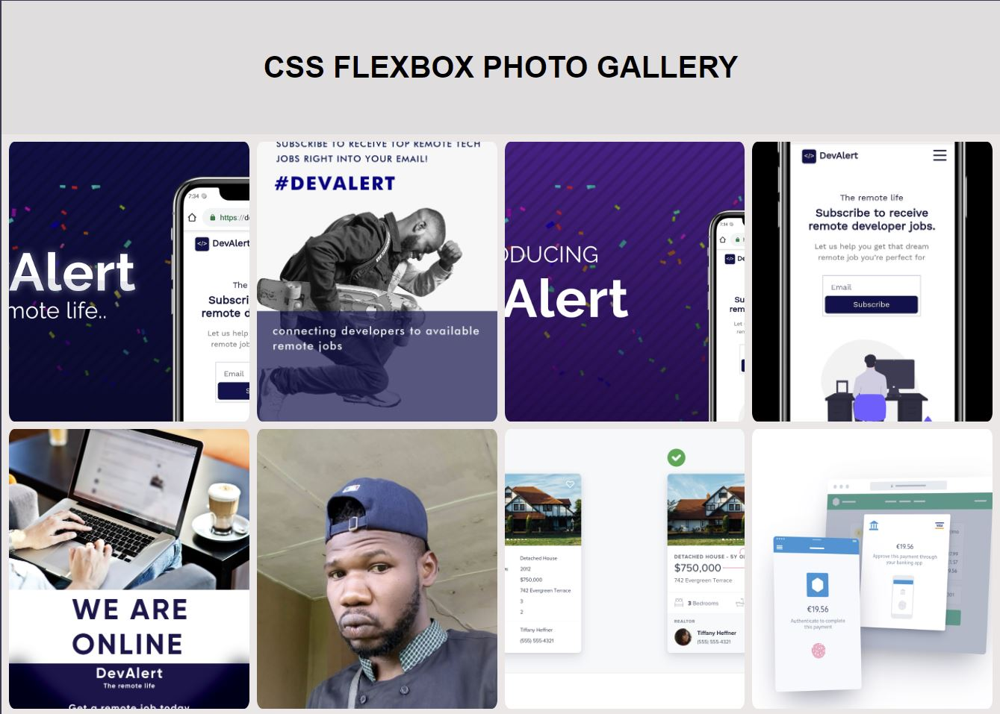
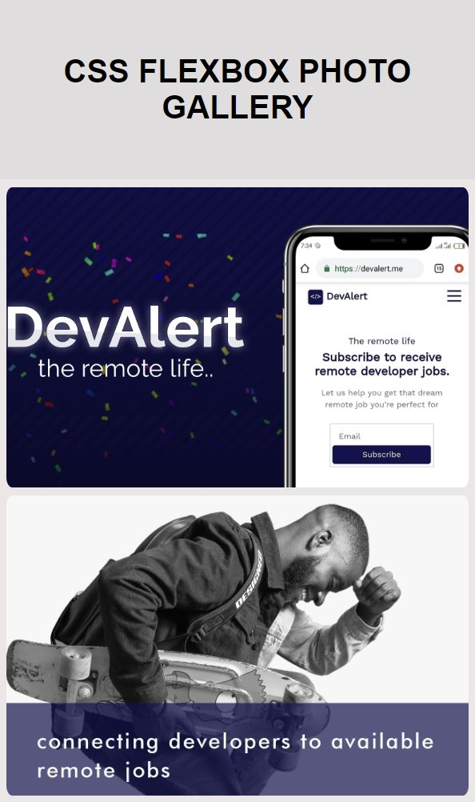

# Learn CSS FlexBox by Building a Photo Gallery

<h1> No media query - Above 800px Width</h1>

<h1> With media query - Below 800px Width</h1>

<h1> With media query - Below 600px Width</h1>

<h1>Class Notes</h1>
•	To normalize the box order I should use the * selector and then setting the box-sizing to border-box.
* { box-sizing: border-box; }
*  
•	We can call the Gallery ID with #ID (#gallery) and then call elements within.
Since our images will be big we should fit them that we will clear view.
#Gallery img { width: 25%;
height: 300px; } 
 
•	I should remove the margin within the body element.
 
•	Flexbox is a one-dimensional CSS layout and control the flow of content. It is offer the ability to control the way items are spaced and aligned within a container.
to use the Flexbox we should set display to flex.
 
•	Flexbox can be used as vertical or horizontal. Flex-direction will control if the X axis is in control with ROW or the Y axis is in control with column.
if we create a photo gallery we should use it as a X axis along the website width and not height.
So I will set the flex-direction to row.
 
•	Flex-warp determines how the items should behave when the flex have little space. Should it go to the next row or not? Setting the property to wrap will tell it to go down a row when the space is maximum. 
 
•	Justify-Content determines how the Items inside a flex container are positioned along the main axis, affecting their position and the space around them.
if we want to centralize the images we should use the center value to this property.
 
•	Align-Items position with flex content along the cross axis. 
 
•	Images often come with height and width and as so doesn't always fit your demands or seems to blur and not be in their best resolution and so. Object-fit will control this problem with setting to fit or cover.
 
•	Creating a media query should be with the @ keyword. (@media) 
it will be used as so : @media (max-width: 800px) { #elements } 
Some devices are smaller than 800px width, and as so we should make them see 2 pictures a row and not 4 pictures a row. Settings width to 50% will do so. 
