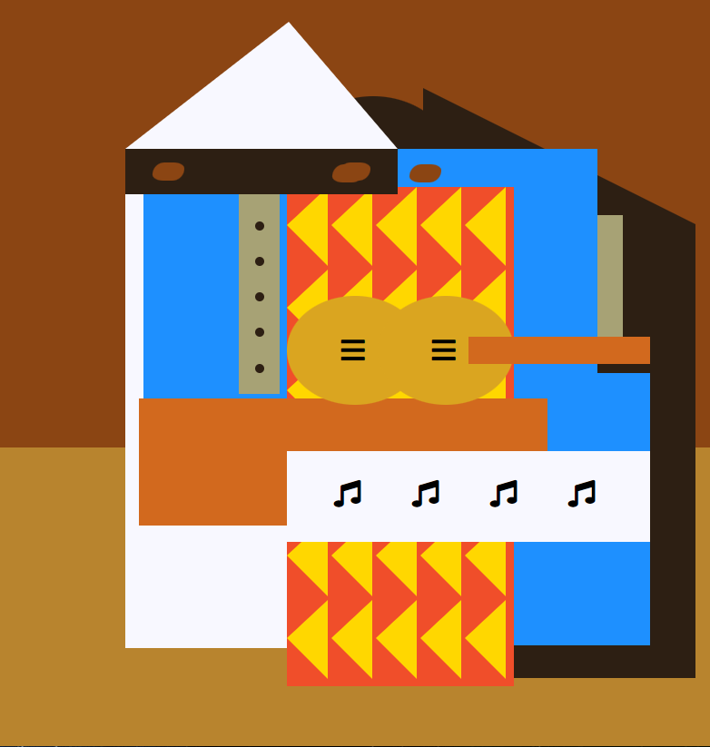

# Learn Intermediate CSS by Building a Picasso Painting

<h1>Class Notes</h1>
Learn intermediate CSS by Building a Picasso Painting 
1.	Absolute position – the position property is used to set the block relative. Then, we can adjust him with top, bottom, left, right.
This way we can set a div block to be full-screen-width. 
2.	Z-inedx is like layers. Elements with higher z-index will be on top of elements with lower z-index. 
3.	I can make out of square a triangle by setting border-top\right\bottom\left-color to transparent and then the left-over will be triangle block. 
4.	Font-Awesome - we link before using element (i) to show a icon. 
by picking class of the right type, it will show Icon on the page.
