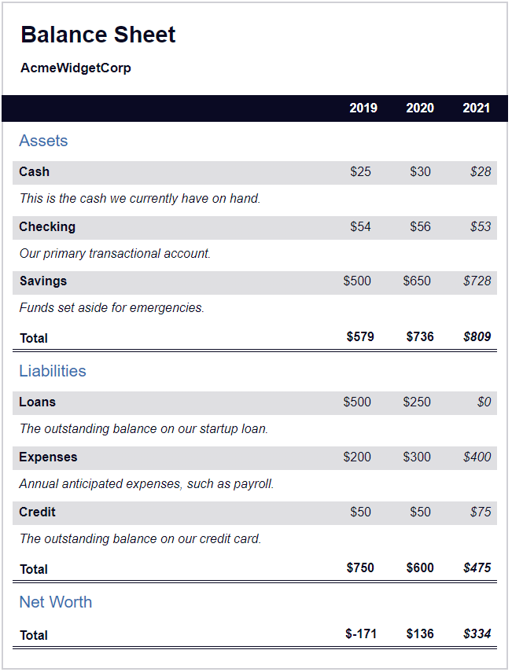

# Learn More About CSS Pseudo Selectors By Building A Balance Sheet

<h1>Class notes</h1>
•	Aria-hidden will hide element from the screen reader. 
 
•	Table element should have the caption element to describe what the table is about.
This can also be used within the css property of caption-side.
 
•	Thead and tbody element are used to indicate which portion of tour table is the header, wand which portion is the body (aka data).
 
•	“tr” element is used to indicate a table row.
 
within a td (table data) and th (table header) will be nested.
 
•	A proper build of a table should be as follow :
 
“table”
 
“caption” “/caption”
 
“thead” “/thead”
 
“tbody”
 
“tr” 
 
“th” “/th”
 
“td” “/td”
 
“/tr”
 
“/tbody”
  
 “/table”
•	I can use CSS to make element with a class completely hidden from visual page but not from screen readers.
For example, span[class~=”sr-only”] will select any span element whose class includes sr-only.
 
•	Css first-of-type and last-of-type will target the first and last of that element.
 
•	CSS calc() function allow to calculate a value based on other values.
 
•	I can target elements with #id element[class] and it will target every element that have a class regardless of the attribute. 
 
•	!important before the ; will make sure the property will not be override.
 
•	The :nth-of-type() pseudo-selector is used to target specific elemnts baed of their order among sibligns of the same type. (tr.total td:nth-of-type(3))
 
•	Vertical-align and text-align
