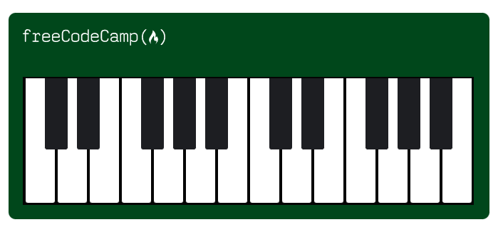

# Learn Responsive Web Design by Building a Piano

<h1>Class Notes</h1>
Learn Responsive Web Design by Building a Piano 
1.	Browsers can apply default margins and paddings to elements. To make sure I reset them I should select html selector and give it the box-sizing: border-box property. 
2.	::before and ::after pseudo-elements – the ::before is the first child of the selected element while ::after is the last child of the selected element.  
3.	Overflow: hidden will hide any element that is pushed outside of the set width value of my property selector. 
