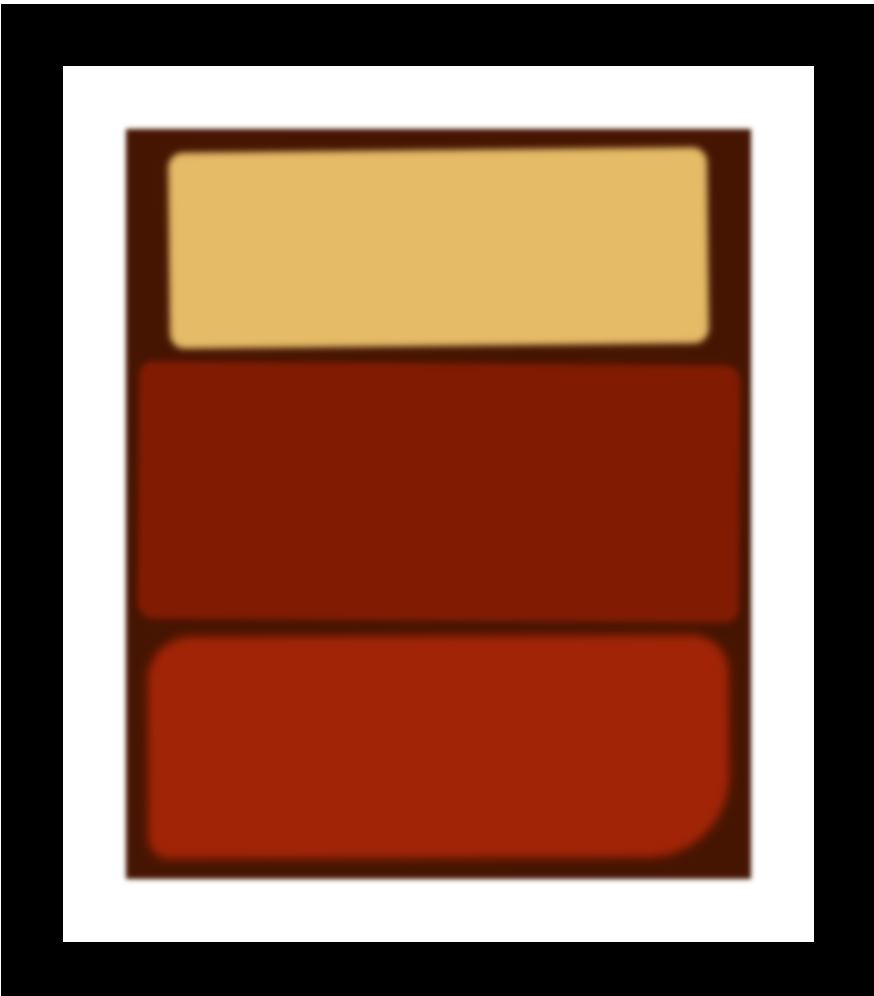

<h1>Class Notes</h1>
Three blocks : Margin, then padding and in the end content.
 
We can think of the padding as the bubble warp that contain the content and the margin as the box itself.
 
1.	Filter: blur
 
2.	Border-radius: topleft topright bottomright bottomleft – 20px 35px 40px 50px
 
3.	Transform: rotate(-0.7deg)

